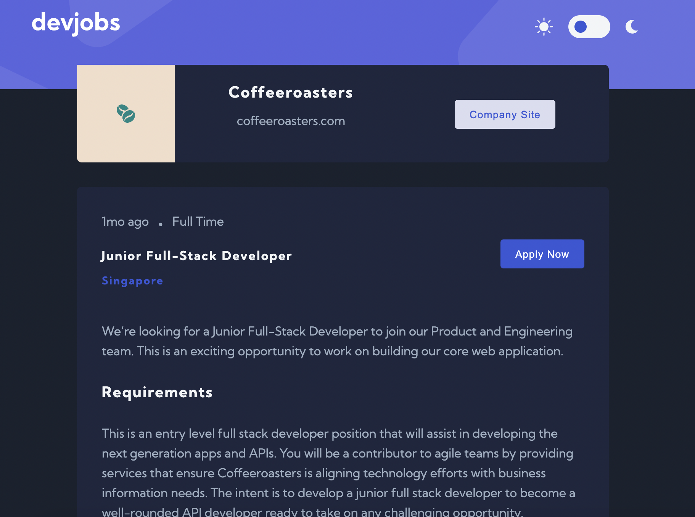
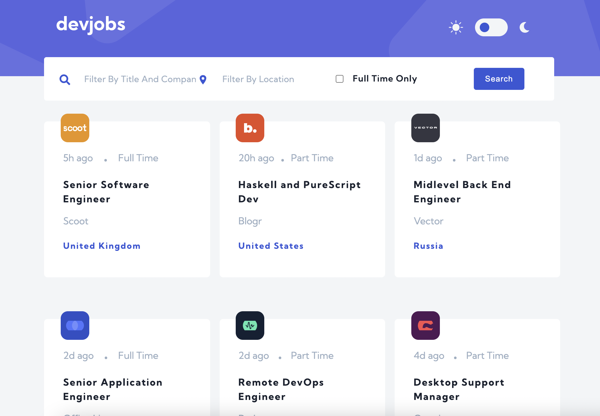

## Devjobs web app // Frontend Mentor // React JS

- [see project]()
- The App is a devjobs board and the data is provided in a local data.json
- The user can filter jobs on the home page by title, location, and whether a job is for a full-time position.
- The user can click on a job from the home page so that they can read more information and apply for the job
- Toggle functionality between light and dark theme, the choice is saved on localStorage.

    

 

    

 
